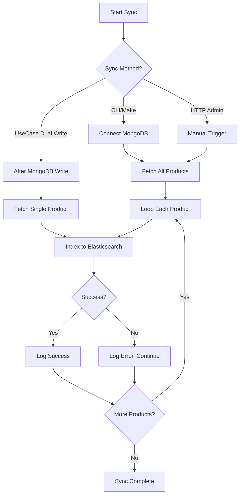

# Elasticsearch Sync Service - Implementation Plan

**Created:** 2026-05-10  
**Status:** Planning  
**Author:** Roo

---

## 📋 Overview

Dokumen ini menjelaskan rencana implementasi **Elasticsearch Sync Service** untuk men-sync data produk dari MongoDB ke Elasticsearch secara otomatis dan manual.

---

## 🏗️ Architecture

```
┌─────────────────────────────────────────────────────────────────┐
│                    SYNC SERVICE ARCHITECTURE                     │
├─────────────────────────────────────────────────────────────────┤
│                                                                  │
│  ┌──────────────────────────────────────────────────────────┐   │
│  │  internal/service/elasticsearch_sync_service.go          │   │
│  │  ─────────────────────────────────────────────────────   │   │
│  │  - SyncAll(ctx) (int, error)      // Bulk sync          │   │
│  │  - SyncSingle(ctx, id) error      // Single product     │   │
│  │  - SyncBatch(ctx, ids) error      // Multiple products  │   │
│  └──────────────────────────────────────────────────────────┘   │
│                           │                                      │
│         ┌─────────────────┼─────────────────┐                   │
│         │                 │                 │                   │
│         ▼                 ▼                 ▼                   │
│  ┌─────────────┐  ┌─────────────┐  ┌─────────────┐            │
│  │  CLI Tool   │  │  UseCase    │  │  HTTP       │            │
│  │  (Make)     │  │  (Dual      │  │  Handler    │            │
│  │             │  │   Write)    │  │  (Admin)    │            │
│  └─────────────┘  └─────────────┘  └─────────────┘            │
│         │                 │                 │                   │
│         └─────────────────┴─────────────────┘                   │
│                           │                                      │
│                           ▼                                      │
│  ┌──────────────────────────────────────────────────────────┐   │
│  │              MongoDB → Elasticsearch                     │   │
│  └──────────────────────────────────────────────────────────┘   │
└─────────────────────────────────────────────────────────────────┘
```

---

## 📁 Files to Create/Modify

| File                                                | Status     | Purpose                           |
| --------------------------------------------------- | ---------- | --------------------------------- |
| `internal/service/elasticsearch_sync_service.go`    | **NEW**    | Core sync logic                   |
| `cmd/sync/es-sync/main.go`                          | **NEW**    | CLI script untuk one-time sync    |
| `Makefile`                                          | **MODIFY** | Tambah command `es-sync`          |
| `internal/product/usecase/product_usecase.go`       | **MODIFY** | Dual write integration (Phase 2)  |
| `internal/product/delivery/http/product_handler.go` | **MODIFY** | Admin endpoint (Phase 3)          |
| `cmd/api/main.go`                                   | **MODIFY** | Dependency injection sync service |

---

## 🔄 Sync Flow



---

## 📝 Detailed Implementation

### 1. Core Sync Service

**File:** `internal/service/elasticsearch_sync_service.go`

```go
package service

import (
    "context"
    "fmt"
    "log"

    "github.com/username/shop-api/internal/domain"
)

type ElasticsearchSyncService struct {
    mongoRepo domain.ProductRepository  // Source of truth
    esRepo    domain.ProductRepository  // Destination
}

func NewElasticsearchSyncService(
    mongoRepo domain.ProductRepository,
    esRepo    domain.ProductRepository,
) *ElasticsearchSyncService {
    return &ElasticsearchSyncService{
        mongoRepo: mongoRepo,
        esRepo:    esRepo,
    }
}

// SyncAll - Bulk sync semua produk dari MongoDB → Elasticsearch
// Returns: jumlah produk yang berhasil di-sync
func (s *ElasticsearchSyncService) SyncAll(ctx context.Context) (int, error) {
    // Fetch all from MongoDB
    products, total, err := s.mongoRepo.FetchWithFilter(ctx, domain.ProductFilter{
        Page:  1,
        Limit: 10000, // Large limit for bulk sync
    })
    if err != nil {
        return 0, fmt.Errorf("failed to fetch products: %w", err)
    }

    // Bulk index to Elasticsearch
    synced := 0
    for _, product := range products {
        if err := s.esRepo.IndexProduct(ctx, product); err != nil {
            log.Printf("⚠️ Failed to index product %s: %v", product.ID, err)
            continue
        }
        synced++
    }

    log.Printf("✅ Synced %d/%d products to Elasticsearch", synced, total)
    return synced, nil
}

// SyncSingle - Sync satu produk by ID
func (s *ElasticsearchSyncService) SyncSingle(ctx context.Context, id string) error {
    product, err := s.mongoRepo.GetByID(ctx, id)
    if err != nil {
        return fmt.Errorf("failed to fetch product: %w", err)
    }

    if err := s.esRepo.IndexProduct(ctx, product); err != nil {
        return fmt.Errorf("failed to index product: %w", err)
    }

    log.Printf("✅ Synced product %s to Elasticsearch", id)
    return nil
}

// SyncBatch - Sync multiple produk by IDs
func (s *ElasticsearchSyncService) SyncBatch(ctx context.Context, ids []string) error {
    for _, id := range ids {
        if err := s.SyncSingle(ctx, id); err != nil {
            log.Printf("⚠️ Failed to sync product %s: %v", id, err)
        }
    }
    return nil
}
```

---

### 2. CLI Script

**File:** `cmd/sync/es-sync/main.go`

```go
package main

import (
    "context"
    "log"
    "os"

    "github.com/joho/godotenv"
    "github.com/username/shop-api/internal/config"
    "github.com/username/shop-api/internal/product/repository"
    "github.com/username/shop-api/internal/service"
)

func main() {
    // Load .env
    if err := godotenv.Load(); err != nil {
        log.Println("⚠️ Warning: .env file not found")
    }

    ctx := context.Background()

    // Connect to MongoDB
    mongoURI := os.Getenv("MONGODB_URI")
    if mongoURI == "" {
        log.Fatal("❌ MONGODB_URI not found")
    }
    mongoClient := config.ConnectMongoDB(mongoURI)
    defer func() {
        if err := mongoClient.Disconnect(ctx); err != nil {
            log.Printf("⚠️ Warning: Failed to disconnect MongoDB: %v", err)
        }
    }()

    dbName := os.Getenv("MONGODB_NAME")
    if dbName == "" {
        dbName = "shop_db"
    }
    mongoRepo := repository.NewMongoProductRepository(mongoClient.Database(dbName))

    // Connect to Elasticsearch
    if os.Getenv("ELASTICSEARCH_ENABLED") != "true" {
        log.Fatal("❌ ELASTICSEARCH_ENABLED is not true")
    }

    esConfig := config.LoadElasticsearchConfig()
    esClient, err := config.NewElasticsearchClient(esConfig)
    if err != nil {
        log.Fatalf("❌ Elasticsearch connection failed: %v", err)
    }
    esRepo := repository.NewElasticsearchProductRepository(esClient)

    // Create sync service
    syncSvc := service.NewElasticsearchSyncService(mongoRepo, esRepo)

    // Run sync
    log.Println("🔄 Starting sync...")
    synced, err := syncSvc.SyncAll(ctx)
    if err != nil {
        log.Fatalf("❌ Sync failed: %v", err)
    }

    log.Printf("✅ Success! Synced %d products", synced)
}
```

---

### 3. Makefile Commands

**File:** `Makefile`

```makefile
## es-sync: Sync MongoDB to Elasticsearch (one-time sync)
es-sync:
	@echo "🔄 Syncing MongoDB to Elasticsearch..."
	@go run cmd/sync/es-sync/main.go
	@echo "✅ Sync completed!"

## es-sync-verbose: Sync with detailed logging
es-sync-verbose:
	@echo "🔄 Syncing MongoDB to Elasticsearch (verbose)..."
	@ES_SYNC_VERBOSE=true go run cmd/sync/es-sync/main.go
	@echo "✅ Sync completed!"
```

---

### 4. Dual Write Integration (Phase 2)

**File:** `internal/product/usecase/product_usecase.go`

```go
type productUseCase struct {
    repo     domain.ProductRepository
    syncSvc  *service.ElasticsearchSyncService  // NEW
}

func NewProductUseCase(
    repo domain.ProductRepository,
    syncSvc *service.ElasticsearchSyncService,
) domain.ProductUseCase {
    return &productUseCase{
        repo:    repo,
        syncSvc: syncSvc,
    }
}

// CreateProduct with dual write
func (u *productUseCase) CreateProduct(ctx context.Context, product domain.Product) error {
    // 1. Write to MongoDB
    if err := u.repo.Create(ctx, product); err != nil {
        return err
    }

    // 2. Async sync to Elasticsearch (non-blocking)
    go func() {
        if err := u.syncSvc.SyncSingle(context.Background(), product.ID.Hex()); err != nil {
            log.Printf("⚠️ ES sync failed: %v", err)
        }
    }()

    return nil
}

// UpdateProduct with dual write
func (u *productUseCase) UpdateProduct(ctx context.Context, id string, update map[string]interface{}) error {
    // 1. Update MongoDB
    if err := u.repo.Update(ctx, id, update); err != nil {
        return err
    }

    // 2. Re-index to Elasticsearch
    product, err := u.repo.GetByID(ctx, id)
    if err != nil {
        log.Printf("⚠️ Failed to fetch product for re-index: %v", err)
        return nil // Don't fail the update
    }

    go func() {
        if err := u.syncSvc.IndexProduct(context.Background(), product); err != nil {
            log.Printf("⚠️ ES re-index failed: %v", err)
        }
    }()

    return nil
}

// DeleteProduct with dual write
func (u *productUseCase) DeleteProduct(ctx context.Context, id string) error {
    // 1. Delete from MongoDB
    if err := u.repo.Delete(ctx, id); err != nil {
        return err
    }

    // 2. Delete from Elasticsearch
    go func() {
        if err := u.syncSvc.DeleteProduct(context.Background(), id); err != nil {
            log.Printf("⚠️ ES delete failed: %v", err)
        }
    }()

    return nil
}
```

---

### 5. Admin HTTP Endpoint (Phase 3)

**File:** `internal/product/delivery/http/product_handler.go`

```go
// Add to routes (admin routes only)
admin.POST("/admin/sync-elasticsearch", handler.SyncElasticsearch)

// Handler implementation
func (h *ProductHandler) SyncElasticsearch(c *gin.Context) {
    ctx := c.Request.Context()

    synced, err := h.syncSvc.SyncAll(ctx)
    if err != nil {
        response.ErrorInternal(c, err)
        return
    }

    response.SuccessSingle(c, "Sync completed", gin.H{
        "synced": synced,
    })
}
```

---

### 6. Dependency Injection

**File:** `cmd/api/main.go`

```go
// After initializing repositories
mongoRepo := repository.NewMongoProductRepository(db)
esRepo := repository.NewElasticsearchProductRepository(esClient)

// Create sync service
syncSvc := service.NewElasticsearchSyncService(mongoRepo, esRepo)

// Pass to usecase (untuk dual write)
productUseCase := productUsecase.NewProductUseCase(mongoRepo, syncSvc)
```

---

## 📊 Implementation Phases

### Phase 1: CLI Sync Service (NOW)

**Goal:** One-time sync untuk development dan testing

| Task                | File                                             | Status |
| ------------------- | ------------------------------------------------ | ------ |
| Create sync service | `internal/service/elasticsearch_sync_service.go` | ⬜     |
| Create CLI script   | `cmd/sync/es-sync/main.go`                       | ⬜     |
| Update Makefile     | `Makefile`                                       | ⬜     |

**Acceptance Criteria:**

- [ ] `make es-sync` berhasil sync semua data
- [ ] Log menampilkan jumlah produk synced
- [ ] Error handling untuk ES connection issues
- [ ] Data bisa di-query via `/products` endpoint

---

### Phase 2: Dual Write (Production Ready)

**Goal:** Real-time sync saat CRUD operations

| Task                     | File                                          | Status |
| ------------------------ | --------------------------------------------- | ------ |
| Update usecase interface | `internal/domain/product.go`                  | ⬜     |
| Implement dual write     | `internal/product/usecase/product_usecase.go` | ⬜     |
| Update main.go DI        | `cmd/api/main.go`                             | ⬜     |

**Acceptance Criteria:**

- [ ] Create product otomatis sync ke ES
- [ ] Update product otomatis re-index di ES
- [ ] Delete product otomatis hapus dari ES
- [ ] Async, non-blocking

---

### Phase 3: Admin Endpoint

**Goal:** Manual trigger via API untuk admin dashboard

| Task               | File                                                | Status |
| ------------------ | --------------------------------------------------- | ------ |
| Add admin endpoint | `internal/product/delivery/http/product_handler.go` | ⬜     |
| Add route          | `internal/product/delivery/http/product_handler.go` | ⬜     |

**Acceptance Criteria:**

- [ ] Endpoint hanya accessible untuk admin
- [ ] Response menampilkan jumlah synced products
- [ ] Progress tracking untuk large datasets

---

## ⚠️ Error Handling

### SyncAll Error Scenarios

| Scenario             | Behavior        | Log                            |
| -------------------- | --------------- | ------------------------------ |
| ES not available     | Return error    | `❌ ES connection failed`      |
| MongoDB fetch error  | Return error    | `❌ Failed to fetch products`  |
| Index product failed | Skip & continue | `⚠️ Failed to index product X` |
| Product not found    | Skip            | `⚠️ Product X not found`       |

### Dual Write Error Scenarios

| Scenario          | Behavior                               | Log                             |
| ----------------- | -------------------------------------- | ------------------------------- |
| ES down           | Operation success, sync fails silently | `⚠️ ES sync failed`             |
| ES timeout        | Async retry (future)                   | `⚠️ ES sync timeout`            |
| Product not found | Skip sync                              | `⚠️ Product not found for sync` |

---

## 🔧 Environment Variables

```bash
# MongoDB
MONGODB_URI=mongodb://localhost:27017/shop_db
MONGODB_NAME=shop_db

# Elasticsearch
ELASTICSEARCH_ENABLED=true
ELASTICSEARCH_URL=http://localhost:9200
ELASTICSEARCH_API_KEY=your-api-key
ELASTICSEARCH_INDEX=products
```

---

## 🧪 Testing

### Manual Testing

```bash
# 1. Run sync
make es-sync

# 2. Verify data di Elasticsearch
curl -H "Authorization: ApiKey ${ELASTICSEARCH_API_KEY}" \
     "${ELASTICSEARCH_URL}/products/_search?size=5"

# 3. Test API endpoint
curl http://localhost:8080/products
```

### Automated Testing (Future)

```go
// internal/service/elasticsearch_sync_service_test.go
func TestSyncAll(t *testing.T) {
    // Mock MongoDB repo
    // Mock ES repo
    // Assert synced count
}

func TestSyncSingle(t *testing.T) {
    // Mock MongoDB repo
    // Mock ES repo
    // Assert product indexed
}
```

---

## 📚 References

- [Elasticsearch Go Client](https://github.com/elastic/go-elasticsearch)
- [MongoDB Driver v2](https://go.mongodb.org/mongo-driver/v2)
- [Elasticsearch Index API](https://www.elastic.co/guide/en/elasticsearch/reference/current/docs-index_.html)

---

## 📝 Notes

1. **Sync Frequency:** Untuk production, pertimbangkan untuk menambahkan rate limiting pada sync operations
2. **Bulk Indexing:** Untuk dataset besar (>10000 products), implementasi bulk indexing dengan batch size
3. **Monitoring:** Tambahkan metrics untuk tracking sync success rate dan latency
4. **Retry Mechanism:** Pertimbangkan untuk menambahkan exponential backoff untuk transient errors

---

## ✅ Next Steps

1. **Phase 1:** Implement CLI sync service (priority: HIGH)
2. **Phase 2:** Implement dual write (priority: MEDIUM)
3. **Phase 3:** Add admin endpoint (priority: LOW)
